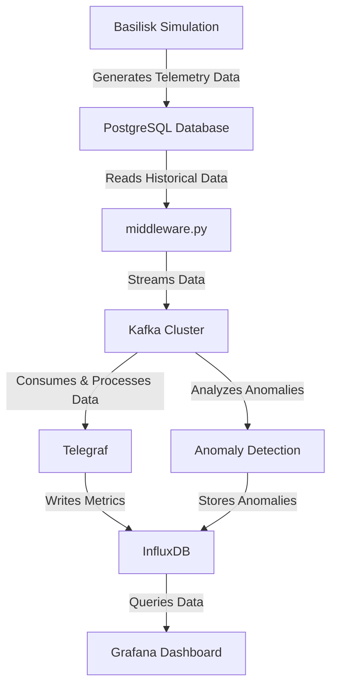

# Satellite Fault Detection System
The following system is used to simulate and test telemetry streams in conjunction with anomaly detection models to help diagnose errors in satellite data and systems. This framework allows for software-in-the-loop simulation, as well as operational deployment of its dashboards and anomaly detection models, due to the use of isolated Docker containers and environments. This applies different layers of abstraction and so long as the interfaces between the systems comply, parts can be supplemented by real-time systems in an operational deployment.

This system simulates satellite telemetry data, streams it through Kafka, processes it for anomalies, and visualizes it via Grafana. It is designed to handle both constellation-level and satellite-specific anomaly detection models. Developers and end-users can easily configure new models, parameters, and simulations by modifying the associated configuration files and Python scripts.

## Key Components 
- **Basilisk Simulation**: Generates telemetry data simulating satellite conditions. 
- **PostgreSQL**: Stores historical telemetry data. 
- **Middleware (`middleware.py`)**: Reads data from PostgreSQL, injects simulation metadata, and streams it into Kafka. 
- **Kafka & Zookeeper**: Provides a high-throughput messaging backbone for real-time data ingestion. 
- **Telegraf & InfluxDB**: Telegraf consumes Kafka messages and writes metrics into InfluxDB, a time-series database. 
- **Anomaly Detection**: Consumes data from Kafka to detect anomalies at both constellation and satellite levels. Results are written to InfluxDB. 
- **Grafana**: Visualizes telemetry data and anomalies, enabling users to explore trends and anomalies over time. 
--- 

## Architecture Diagram


### Data Flow Explanation
**From Simulation to PostgreSQL**: The Basilisk simulation framework generates telemetry data representing satellite conditions and events. This data is stored in a PostgreSQL database, acting as a historical and retrieval point.

**From PostgreSQL to Kafka (middleware.py)**: The `middleware.py` script periodically reads data from PostgreSQL and streams it into Kafka. This transforms the static data into a real-time data feed, allowing downstream systems to process live telemetry.

**From Kafka to InfluxDB (via Telegraf)**: Kafka, serving as a high-throughput messaging system, makes the telemetry data available to various consumers. Telegraf, configured as a Kafka consumer, ingests the telemetry data from Kafka and writes it into InfluxDB, a time-series database optimized for storing and querying time-stamped events.

**From Kafka to Anomaly Detection**: In parallel, another consumer (the anomaly detection service) subscribes to the Kafka topic. It analyzes incoming data for anomalies at both the constellation and satellite levels. When it detects anomalies, it records the details back into InfluxDB for visualization and further analysis.

**From InfluxDB to Grafana**: Grafana queries InfluxDB to display the telemetry data and detected anomalies on interactive dashboards. Users can filter, visualize trends, and gain insights into the satellite constellation’s behavior and any anomalies that have been detected.

The entire pipeline allows for seamless data flow from simulation to storage, streaming, detection, and visualization. New developers or users of the system can quickly understand that Basilisk’s generated data is stored, transformed into real-time streams, processed for anomalies, and ultimately visualized—providing a comprehensive and easily extendable telemetry monitoring and analysis framework.

## Getting Started
### Prerequisites

-   **Docker & Docker Compose**: Ensure both are installed and working.
-   **Python 3.10+**: Required for certain scripts if you run them locally outside of Docker.

### Installation & Setup

1.  Clone the Repository:
```bash
git clone https://github.com/varun-un/Sat-Fault-Detection.git 
cd Sat-Fault-Detection
```
2. Build and Start Containers:
```bash
docker-compose build 
docker-compose up -d
```
This starts PostgreSQL, Kafka, Zookeeper, Telegraf, InfluxDB, Grafana, and the anomaly detection service.

## Usage
To use the system, you can interact with each container by opening its terminal either by running `docker-compose up -it <name_of_container>` or opening the terminal under Docker Desktop. 

### **sim_middleware**:
First, run `/bin/bash` to start the bash terminal.

Write any simulation script in the `simulations/` folder. This can use Basilisk or some other simulation method, but it should write the output to a new table in the PostgreSQL. The table should have the following schema:

| time 	| satellite_id	| data		|
|-------|----------------|------|
| Time 	| Integer 	| JSONB	|

The `time` should be the timestamp, in UNIX seconds, the `satellite_id` is a unique ID number to reference the satellite, and the `data` column is a JSON of all the data for that row. The schema for the JSON will ideally be consistent in each row, but different keys in each JSON entry may represent differential or missing data. The primary key for each entry is `(time, satellite_id)`, so for each satellite in a constellation (or single satellite system), there may only be one entry for that time point.

Each table entry must have a unique name, such as `simulation_1`. Once the script has been written, and run in order to generate the new table, return to the `/basilisk/` folder and run:
```bash
python middleware.py <name_of_table> 
```

To view the existing tables in PostgreSQL, you can run the following in the terminal:
```bash
su - postgres
psql telemetry_db
\c telemetry_db
\dt
```
To return to the terminal, run:
```sql
\q
exit
```

### **influx_telegraf**
This container includes the frontend databases that receive the data. Since the backend can be abstracted away to the actual satellites in an operational scene, this database will be used as the main source of persisted data. Grafana, or the frontend visualization, will query this Influx database. InfluxDB will hold two tables or measurements: `telemetry_data` and `anomalies`.

If starting the container, it may still hold the data and anomalies from previous instances, which may still show up on the Grafana dashboard. If this is not desired (if the system is being used as a testbed), you can view it and clear it out by running the following commands in the terminal for this container:

```sql
/bin/bash
influx
USE telemetry_db;
SELECT * FROM telemetry_data;
SELECT * FROM anomalies;
DROP SERIES FROM "telemetry_data";
DROP SERIES FROM "anomalies";
```

### anomaly_detection
The Anomaly Detection System is a robust framework designed to monitor and analyze telemetry data from individual satellites or entire satellite constellations. By leveraging customizable anomaly detection models, the system identifies potential irregularities in real-time, ensuring timely responses to anomalies that could affect satellite operations.

Key features include:

-   Extensibility: Easily add custom anomaly detection models.
-   Real-Time Processing: Integrates with Kafka for data ingestion and InfluxDB for anomaly recording.
-   Modular Design: Separates constellation-level and satellite-specific anomaly detection.
-   Configurable Deployment: Utilize a JSON configuration file to manage models and parameters dynamically.

##### AnomalyDetails Class

A data structure used to encapsulate details about detected anomalies.
Attributes:
-   `satellite_id`: Identifier for the satellite where the anomaly was detected.
-   `anomaly_model`: Name of the anomaly detection model that identified the anomaly.
-   `time`: Timestamp marking the start of the anomaly.
-   `time_end`: Timestamp marking the end of the anomaly.
-   `metric`: Specific telemetry metric that triggered the anomaly.
-   `value`: The anomalous value detected.
-   `message`: Descriptive message about the anomaly.

#### Abstract Base Classes

To ensure a standardized approach for different anomaly detection models, the system defines abstract base classes for both satellite-specific and constellation-level models.

##### SatelliteAnomalyDetectionModel

Abstract base class for satellite-specific anomaly detection models. When the container starts, the `anomaly_manager.py` script will create an instance of a subclass of this for every unique `satellite_id` it receives from the telemetry data through Kafka. Subclasses of this model should be used to identify independent faults within an individual satellite. 
Key Methods:

-   `detect(data)`: Processes telemetry data to identify anomalies. Returns a tuple of type `(bool, AnomalyDetails)`
-   `load_model()`: Loads or initializes the detection model.

##### ConstellationAnomalyDetectionModel

Abstract base class for constellation-level anomaly detection models. Only one instance of each `ConstellationAnomalyDetectionModel` will be created per telemetry stream. This class and its subclass children receive the entire context of the satellite system and thus can identify more broad macroscopic faults. 
Key Methods:

-   `detect(data)`: Analyzes telemetry data across the constellation to identify anomalies. Returns a tuple of type `(bool, AnomalyDetails)`
-   `load_model()`: Loads or initializes the detection model.

#### Configuration Management

The system uses a `config.json` file to manage and deploy anomaly detection models dynamically. This approach allows for flexible adjustments without modifying the core codebase.

##### config.json Structure

An example configuration file:
```json
{
   "constellation_models": {
       // Define constellation-level models here
   },
   "satellite_models": {
       "OutlierDetectionModel": {
           "path": "./satellite/outlier_detection.py",
           "parameters": {
               "threshold": 2,
               "metric": ["CSS_4", "CSS_5"]
           }
       }
   }
}
```
**Sections:**

-   `constellation_models`: Defines models that analyze data across the entire satellite constellation.
-   `satellite_models`: Defines models that analyze data for individual satellites.

**Model Definition Fields:**

-   `path`: Relative path to the Python file containing the model class.
-   `parameters`: Dictionary of parameters to pass to the model's constructor. Will be passed in as keyword arguments.

#### Initialization

Upon startup, the `AnomalyDetectionManager` initializes by loading models based on `config.json`, setting up the InfluxDB client, and ensuring the necessary InfluxDB measurements exist. The manager processes incoming telemetry data from Kafka by passing it through both constellation-level and satellite-specific models.

The manager will automate the creation of instances of the anomaly detection model classes, and will pipe the data to each running model specified in the config file. When a model indicates a potential fault, it parses the fields in the returned `AnomalyDetails` dataclass, and writes a new entry for it to InfluxDB's *anomalies* measurement.

### grafana
Grafana is the frontend dashboard and visualization for anomalies and the telemetry data. Its primary two dashboards display time-series data from the payload JSONs of the telemetry data, grouped together by either similar satellite_id or similar data field. These can be found at:
[http://localhost:3000/dashboards](http://localhost:3000/dashboards)

The default login for Grafana is:
username: `admin`
password: `admin`